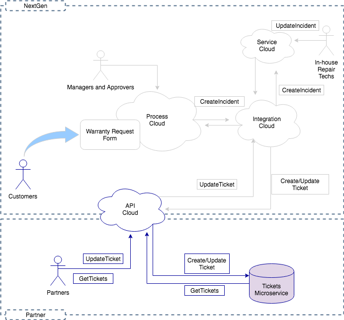

# 保証クレーム

## イントロダクション

NexGenは多種多様な製品を扱う会社です。製品の販売の一環として、NexGenは保証範囲を提供し、お客様は保証契約に基づいてサービスを請求する必要があります。NexGenのマネジメントは、製品ラインが増えると共に、保証の履行を維持するコストが大幅に増加することを懸念しています。最近の戦略セッションで、NexGenは保証請求管理を改善できるいくつかの分野を特定しました。

### 特定した問題点

現時点での問題点は次のとおりです。

1. 請求の取り込みが手作業であり、非常に高コストです。電話や郵便で請求されることがあるため、担当者が詳細を知るために顧客に連絡しなければならないことが多々あります。
2. サービスリクエストの処理は、手作業のプロセス、および過去数年間の買収によるレガシーシステム全体に広がっています。
3. 会社は実際の修理を行うために大規模なスタッフを維持しなければならず、また、ポートフォリオ内の特定の製品のスキルセットを維持することがますます困難になってきています。

### 提案された解決策

ここでは、ソリューションの重要な側面のいくつかを紹介します。

- 最新のサービスチケットシステムを使用します。
  - NexGenは**Oracle Service Cloud**を選択し実装しました。これにより、すべてのNexGenセールスおよびサービスの従業員が顧客を簡単に引き受けることができます。
- 顧客が保証請求できるよう最新のWebインターフェイスを作成します。このインタフェースは、さまざまなレガシーバックエンドシステムやSaaSアプリケーションに接続できるプロセス管理システムの一部でなければなりません。
  - NexGenは**Oracle Integration Cloud**を選択して実装しました。これにより、エラーを起こしやすい多くの手作業が省略できるだけでなく、将来の柔軟性も向上できます。
- 特定の製品ラインの修理を担当できるサービス会社と一連のパートナーシップを締結します。これらのパートナーは、NexGenが製品を修理したり直接置き換えたかのように、修理およびチケットのステータスの更新を完了して、NexGenを代表することが期待されています。
- 大規模な調査結果、NexGenはAPI管理のライフサイクルを完全にサポートする唯一のソリューションである**API Platform Cloud Service**を選択しました
- **API Platform Cloud Service**を使用して、NexGenはインシデントのクエリと更新を行うためのAPIをパートナーに提供します。
  - このAPIは、**Oracle Service Cloud**のようなバックエンド/ SaaSアプリケーションにパートナーを追加せずに、パートナーに必要なアクセスを提供します。
- パートナーは独自のマイクロサービスベースのサービスチケットシステムを持ち、**API Platform Cloud Service**を使用して、サービスチケットの作成、クエリ、および更新用のAPIを提供します。

### ソリューション内の製品

1. Oracle Integration Cloud（他の演習で実施）
    1. Webフォームを作成し、保証請求ビジネスプロセスに接続する（Process）
    1. RESTインターフェイスを使用してService Cloudに接続します。メッセージを再構成し、必要に応じてオーケストレーションを提供する（Integration）
1. Oracle API Platform Cloud（この演習で実施）
    1. マイクロサービスとやりとりするAPIを作成する（最初は、用意されたモックサービスを使用できます）。
    1. マイクロ・サービス・アーキテクチャ・スタイルは基本的に特定の機能を1つのサービスにカプセル化する。例えばこのケースでは、ServiceTicketはサービスチケットの作成、更新、クエリに関係するが、顧客、パートナー、部品には関係しない。データは他のシステムにあっても、そのコピーを保持する。
    1. APIをインテグレーション・サービスにリンクする。パートナーがサービスチケットを更新するたびに、その更新を自動的に他の内部システムに伝播し、パートナーが内部システムのユーザーであるようにサービスリクエストを更新できる。

この一連のラーニング・パスとチュートリアルでは、主にこのシナリオの**API**部分を活用します。このユースケースの概要図は次の通りです。



## 保証請求チケットサービスAPIの実装

ここまでで、上記のNexGenのユースケースを理解しました。以下はプロジェクトマネージャから受け取ったプロジェクト要件です。

### 始める前に

このユースケースを進める際には、Oracle API Platform Cloud ServiceおよびOracle Apiary Cloud Serviceにアクセスする必要があります。必要がある時点で、このチュートリアルでアドバイスがあります。

### 環境の選択

講師主導のイベントに参加している場合は、講師が環境の利用方法を提示します。ご自身の環境にアクセスしている場合は演習を進める環境を選択する必要があります。

利用可能な環境の詳細については、[API Platform Demo Environments](../../environments/README.md)を参照してください。

> 注：リンクは常に新しいタブで開いてください（右クリック→*新しいタブでリンクを開く*）。そうすれば、タスクを完了後にリンク先のチュートリアルなどからこの演習ガイドに戻ってくることができます。

### APIの設計

優れたAPIの第一歩としてデザインは非常に重要です。コラボレーションにより、正しい設計を確実に作成できます。APIは十分に文書化されている必要があり、APIを素早くプロトタイプ化するためにモックサービスを作成する必要があります。

-  [APIの設計](../../tutorials/design/design_api)チュートリアルに従って、APIを設計します。

これで、すべてのステークホルダーが明確に理解し合意したAPIデザインが完成しました。エンジニアリングチームはモックサービスを活用してそれぞれのコンポーネントを開発できます。これは最終的にパートナーが利用できるようになるので、ポリシー施行の実装を開始したいと考えています。

### APIポリシーの実装作成

優れたAPIは、単純なRESTサービスの枠を超え、適切なSLAの下、承認されたユーザーのみアクセスできるように、管理対象エンドポイントを提供します。この管理対象のエンドポイントを作成するには、まずAPIポリシー実装を作成します。

- [APIポリシー実装の作成](../../tutorials/manage/apis/create_api)チュートリアルに従ってAPIを作成します。

    > 注：リンクは常に新しいタブで開いてください（右クリック→*新しいタブでリンクを開く*）。そうすれば、タスクを完了後にリンク先のチュートリアルなどからこの演習ガイドに戻ってくることができます。

この時点で、*プロキシパターン*を提供する単純なAPIポリシーを実装しました。 *プロキシパターン*は、リクエストを受け取り、そのリクエストを別のエンドポイントにルーティングする単純なエンドポイントです。もちろん、APIは定義されているだけで、まだ動作していません！

- [APIのデプロイ](../../tutorials/manage/apis/deploy_api)チュートリアルに従ってAPIをデプロイしてください
  - ゲートウェイに特定のGrantを適用する必要があるかもしれないことに注意してください。その場合は、[ゲートウェイ上のアクセスGrantの管理](../../tutorials/manage/gateway/grant)に従ってください。

必要に応じて、APIマネージャがAPI実装を作成し、別の人がゲートウェイへのデプロイを実行することがあります。これは、デプロイメントへのアクセスを制限するプロダクションゲートウェイの場合に最適です。

リクエストを受け取り、バックエンドサービスにルーティングするAPIが用意されました。この時点でのバックエンドサービスは、Apiaryのモックサービスです。なぜモックサービスURLを使用すべきなのでしょうか？複数のチームが開発プロセスに参加していたり、新しいモバイルアプリやチャットボットを作成するフロントエンド開発者がいたり、バックエンドのサービスと統合チーム、そしてもちろんAPIチームが存在していたりする可能性が多々ありますが、バックエンドサービスがまだ準備されていない場合でも、モックサービスをバックエンドサービスとして指定した上で、API実装の作成を開始できます。

ひょっとすると基本的な実装から始めたいかもしれません。そのような場合も、完全に運用可能になる前に、フロントエンドの開発者はAPIを利用できます。

#### APIのテスト

APIをデプロイしたので、すべてが期待通りに機能するかどうかをテストできます。

APIを呼び出す方法についてのヘルプが必要な場合は、[APIの呼び出し](../../tutorials/manage/apis/invoke_api/README.md)を参照してください。

##### APIの呼出し

あなたの好きなRESTクライアントを選んでください。この演習では、単純な*GET*リクエストであるため、Webブラウザを使用できます。

- ロードバランサのURLを使用する（ロードバランサのURLの取得する方法については、[APIの呼び出し](../../tutorials/manage/apis/invoke_api/README.md)を参照してください。）
  - 例：`http://<host>:<port>/ticketService/1/tickets`
- メソッド：GET
- ヘッダー（オプション）：
  - Accept：application/json
- APIにリクエストを送信する

ポリシーを適用していないため、リクエストは検証されることなくバックエンドサービスに渡されます。これは単純に*プロキシパターン*で、呼び出しの結果、次のような応答を受け取ったはずです。

```json
{
    "_items": [
        {
            "customer": "ACME Corp",
            "status": "Resolved",
            "product": "Widget",
            "_id": "589a3774ebee507f7268bcff",
            "_updated": "Tue, 07 Feb 2017 22:05:38 GMT",
            "summary": "Customer reports the widget stopped working",
            "_links": {
                "self": {
                    "href": "tickets/589a3774ebee507f7268bcff",
                    "title": "Ticket"
                }
            },
            "_created": "Thu, 01 Jan 1970 00:00:00 GMT",
            "ticketID": "45001",
            "_etag": "bd584d9a460eabdc979e428e1e0220923b0c5793",
            "subject": "Widget stopped working"
        },
        {
            "customer": "ACME Corp",
            "status": "Unresolved",
            "product": "Widget",
            "ticketID": "45002",
            "_updated": "Tue, 07 Feb 2017 21:44:21 GMT",
            "summary": "Customer reports the widget stopped working",
            "_links": {
                "self": {
                    "href": "tickets/589a3fb534605c000176ef5f",
                    "title": "Ticket"
                }
            },
            "_created": "Tue, 07 Feb 2017 21:44:21 GMT",
            "_id": "589a3fb534605c000176ef5f",
            "_etag": "cfe52a36fa7a1c738acc994f6e49a8f3f86ce4bf",
            "subject": "Widget stopped working"
        },
        {
            "customer": "ACME Corp",
            "status": "Unresolved",
            "product": "Widget",
            "ticketID": "45002",
            "_updated": "Tue, 07 Feb 2017 21:44:37 GMT",
            "summary": "Customer reports the widget stopped working",
            "_links": {
                "self": {
                    "href": "tickets/589a3fc534605c000176ef60",
                    "title": "Ticket"
                }
            },
            "_created": "Tue, 07 Feb 2017 21:44:37 GMT",
            "_id": "589a3fc534605c000176ef60",
            "_etag": "dbcf344b1bcaf9fc6781846ed944d147a875394c",
            "subject": "Widget stopped working"
        },
        {
            "status": "Resolved",
            "_updated": "Tue, 07 Feb 2017 21:57:59 GMT",
            "_links": {
                "self": {
                    "href": "tickets/589a4133fbcb600001ac564b",
                    "title": "Ticket"
                }
            },
            "_created": "Tue, 07 Feb 2017 21:50:43 GMT",
            "_id": "589a4133fbcb600001ac564b",
            "_etag": "a8706300f0a38c1d6aa871901475d2f7a9e29e1d"
        },
        {
            "customer": "Smithers Corp",
            "status": "Unresolved",
            "product": "Idea tablet",
            "ticketID": "45003",
            "_updated": "Sun, 12 Feb 2017 21:28:52 GMT",
            "summary": "When powering up unit, the display is blank",
            "_links": {
                "self": {
                    "href": "tickets/58a0d394e0577b0001bcc981",
                    "title": "Ticket"
                }
            },
            "_created": "Sun, 12 Feb 2017 21:28:52 GMT",
            "_id": "58a0d394e0577b0001bcc981",
            "_etag": "7a898301b641f1f28dbcf69a6c0dfadf292d6861",
            "subject": "Display blank"
        }
    ],
    "_links": {
        "self": {
            "href": "tickets",
            "title": "tickets"
        },
        "parent": {
            "href": "/",
            "title": "home"
        }
    },
    "_meta": {
        "max_results": 25,
        "total": 5,
        "page": 1
    }
}
```

> アナリティクスを確認すると、先ほどの呼び出しが表示されるはずです。APIマネージャとしてログインし、APIを選択してアナリティクスのサイドタブをクリックします。ゲートウェイマネージャとしてサインインし、ゲートウェイを選択してアナリティクスのサイドタブをクリックします。ゲートウェイマネージャとAPIマネージャの分析ビューにどのような違いがありますか？

### APIへのポリシーの追加と設定

API Platform Cloud Serviceのポリシーは、さまざまな目的で利用します。 セキュリティ、スロットル、トラフィックの制限、ルーティング、またはロギング のために、API定義に任意の数のポリシーを適用できます。適用されるポリシーによっては、各ポリシーを構成するときに指定した基準を満たさない場合、リクエストを拒否できます。ポリシーは、*リクエスト*タブと*レスポンス*タブに表示される順に実行されます。ポリシーは、実行フローの特定の場所にのみ配置できます。この演習では、各ポリシーを配置する場所を明示しています。

これらの演習では、次のポリシーを適用します。

- セキュリティ
  - キー検証（*ドラフト*）
- トラフィック管理
  - アプリケーション・レート制限（*ドラフト*）
- インタフェース管理
  - ヘッダー検証
  - インタフェース・フィルタ
- その他
  - Groovy Script

> 注：キー検証およびアプリケーション・レート制限ポリシーは**ドラフト**として適用します。演習で後で有効にします。これらは、アプリケーションを作成して登録する必要があります。これについては、後の章で説明します。

信じられないと思いますが、実はすでにポリシーを適用しています！*APIリクエスト*と*サービスリクエスト*はポリシーなので、ポリシー適用の一般的な手順に慣れているはずです。ここでは、使用するポリシーと設定値をお知らせしますので、例を参照せずに設定できる試してください。でも、心配しないでください。わからなくなったときは例を見れば理解できるはずです。

『API実装』をまだ実施していない場合は、

- APIマネージャとしてAPI Platform Cloud Serviceにログイン
- *APIs*を選択
- APIを選択
- *API実装*サイドタブをクリック

> 注：右側にはグループで折りたたまれているポリシーがあります。グループを展開してポリシーを表示できます。

ポリシーを適用するには

- 右のリストでそのポリシーにマウスを移動し、*適用*をクリック
- ウィザード（複数のパネルで構成されている可能性があります）内のフィールドを入力
- ポリシーを設定後、*適用*または*ドラフトとして適用 *をクリック
  - *適用*でポリシーエントリを保存
  - *ドラフトとして適用*でドラフトとして保存（*適用*するまでアクティブにならない）

それでは、このAPIにポリシーを適用しましょう。

#### セキュリティ

セキュリティから始めます。*キー検証*ポリシーを設定します。我々はこのポリシーをAPIに適用したいのですが、まだ有効化したくないため、この時点ではドラフトとして保存します。これにより、アクティブ化する前に、実装の調整及び他の人との協力ができます。以下の要件を満たす*キー検証*ポリシーを追加できるかどうか試してください。

##### キー検証（ドラフト）

- キー配布アプローチ ：ヘッダー
- キー・ヘッダー ：app-key

ポリシーを*ドラフトとして適用*

#### トラフィック管理

優れたAPIは、そのAPIが悪用されないようにしています。1つのアプリケーションがある期間内に行えるリクエストの数を制御する*アプリケーション・レート制限*ポリシーを適用したいと考えています。*キー検証*ポリシーをまだ有効化していないため、このポリシーもドラフトとして保存します。

##### アプリケーション・レート制限（ドラフト）

- *キー検証*ポリシーの後に配置します。
- アプリケーション当たりのレート制限 ：10
- 時間間隔：分

ポリシーを*ドラフトとして適用*

#### インタフェース管理

場合によっては、リクエストに特定のヘッダーが含まれていることを確認するか、ヘッダーが特定の値の範囲内にあることを確認する必要がありますが、そのような場合に*ヘッダー検証*ポリシーを使います。*キー検証*および*アプリケーション・レート制限*ポリシーの後でヘッダーを検証するようにしてください。このポリシーはアプリケーションに関連していないため、設定後すぐに適用できます。

##### ヘッダー検証

- *アプリケーション・レート制限*ポリシーの後に配置します。
- 次のヘッダー条件の*いずれか*が満たされた場合、リクエスを*パス*します。
- tenant-id >= 1

ポリシーを*適用*

これまでの実装を確認しましょう。APIの*キー検証*、*アプリケーション・レート制限*、*ヘッダー検証*ポリシーの違いに注目してください。最初の2つは、ドラフトとして保存されていることを示す点線で囲まれています。

###### APIの再デプロイ

APIを再デプロイします。やり方がわからない場合、[APIのデプロイ](../../tutorials/manage/apis/deploy_api)に従ってください。デプロイされた、またはデプロイメントをリクエストしたら、ゲートウェイの視点からAPIデプロイメントを確認してください。 APIのデプロイメントを展開してください。*ドラフトとして適用*されているポリシーが表示されていますか？

##### インターフェース・フィルタ

*インターフェース・フィルタ*ポリシーを適用します。このポリシーは、リクエストで指定されたリソースとメソッドに基づいてリクエストをフィルタ処理するために使用されます。ここでは、このポリシーを設定して、リソース*/tickets*（すべてのチケットを返す）へのGETリクエストを処理しますが、他のタイプのリクエストはすべて拒否します。

- *ヘッダー検証*ポリシーの後に配置します。
- リソースとメソッドの組み合わせが次にリストされている場合、リクエストを通します（*パス*）。
  - 条件1
    - リソース：/tickets
    - メソッド：GET

ポリシーを*適用*

#### その他

##### Groovyスクリプト

*Groovyスクリプト*ポリシーは、ポリシーがまだ存在しない場合に、機能を追加するために多用することになるでしょう。この演習では非常に単純なGroovyスクリプトを追加して、このポリシーの仕組みを見ていきます。今回のスクリプトは、この演習の目的のために以下のように非常にシンプルなものです。

```groovy
if (context.apiRequest.getHeader("Content-Type") == null)
    context.serviceRequest.setHeader("Content-Type", "application/json")
```

groovyポリシーを次のように追加します。

- *インターフェース・フィルタ*ポリシーの後に配置します。
- 上記のgroovyスクリプトを入力します。

ポリシーを*適用*

APIを*保存*

変更を有効化するため、APIを再デプロイしてください。

### APIの呼出し

APIにポリシーを正常に追加できたので、ポリシーが意図したとおりに機能するかを検証するため、リクエストを送信できます。すでにAPIを呼び出しているので、お気に入りのRESTクライアントでAPIをもう一度呼び出してください。やり方がわからない場合は、この演習の[APIの呼び出し](#invoke-the-api)部分をご覧ください。

今回は、APIを呼び出すと、*Bad Request*メッセージでリクエストが拒否されます。どうして？*ヘッダー検証*ポリシーのため、値が1以上の*tenant-id*をヘッダーを含める必要があります。

RESTクライアントで、次のリクエストヘッダーを追加します

- 名前：tenant-id
- 値：1

[APIの呼び出し](#invoke-the-api)チュートリアルのようにレスポンスを受け取るはずです。

さて、別のリソースを呼び出しましょう。

RESTクライアントでは、URLの*tickets*部分を*partners*に置き換えて、リクエストを再度送信してください。

*インターフェース・フィルタ*ポリシーを設定した場合は、次のレスポンスを受け取るはずです。
*Method not allowed*メッセージでリクエストが拒否されます。それは、*インターフェイス・フィルタ*ポリシーのため、このリソースへのリクエストが拒否されたからです。このポリシーは、*/tickets*以外のリソースへのリクエストを拒否します。これは、背後のAPIを保護し、公開する予定のないリソースの呼び出しを防止するために設計されています。

### APIの公開

[APIの公開](../../tutorials/manage/apis/publish_api)に沿ってAPIを公開してください。

- エンドポイントを選択するときは、共有環境を使用している場合は、一意に保つように変更する必要があるかもしれません。

### APIプランの作成

APIが開発者ポータルに公開されました。API利用者はそのAPIを発見できますが、使用するためには、プランに対する資格をAPIに追加する必要があります。

APIプランは、APIとアプリケーションの交点を表します。 APIとアプリケーション両方とも、プランの資格を持つ必要があります。

APIに資格を与える前に、プランを作成するために*プラン・マネージャ*が必要です。

> 注：デモ／トレーニング環境を使用している場合は、このステップをスキップして、APIに資格を与える際に*DeveloperPlan*を選択できます。もちろん独自のプランを作成することもできますが、API名などと同じように一意にする必要があります。

[プランの作成](../../tutorials/manage/plans/create_plan)に従って、APIの新しいプランを作成します。

### APIへのプラン付与

*キー検証*ポリシー（ドラフトとして保存済み）を追加した際、アプリケーションにAPIを呼び出す資格を要求することによって、APIへのアクセスを制御する最初のステップを完了しました。後でそのポリシーを有効化すると、利用者は登録済みのアプリケーションからAPIを呼び出す必要があります。つまり、そのAPI、ならびにアプリケーションは、それぞれプランに対する資格が付与されている必要があります。APIへのアプリケーションの関連付けは、プランを使って実現します。

アプリケーションに対しAPIを呼び出しの資格を付与するには、主に2つのタスクが必要です。

1. APIプランを作成する（または既存のAPIプランを選択する）
   - プランを作成するには、*プラン・マネージャ*ロールが必要です。
   - 既存のプランを選択するには、プラン・マネージャから*資格付与*権限をもらっておく必要があります。
2. アプリケーションを作成 （または既存のアプリケーションを選択）し、そのアプリケーションにプランの資格を与えます。
   - *APIマネージャ*または*アプリケーション開発者*として、アプリケーションを作成できます。

プラン*DeveloperPlan*にあなたのAPI資格を付与するには、[プランへAPIの資格付与](../../tutorials/manage/apis/entitle_api)に従ってください。

#### アプリケーションの登録

*APIマネージャ*として、*アプリケーション*メニューを選択します。

1. 指示されている命名規則に従ってアプリケーションを作成する

作成したアプリをクリックし、左側の*サブスクリプション*タブをクリックします。 *DeveloperPlan*の資格を追加するには、*プランにサブスクライブ*をクリックします。

後で使用するためにアプリケーション・キーをメモしておきましょう。

#### アプリケーション登録リクエストGrant（参考のみ、この章では操作不要）

アプリケーション登録Grantと同様に、アプリケーション開発者またはAPIマネージャには、アプリケーション登録リクエストGrantが付与されており、Grant付与済みのユーザーは登録リクエストのみ可能です。リクエストがAPIマネージャによって審査されている間、APIを使用することはできません。APIマネージャが登録リクエストを承認すると、ランタイムのキー検証ポリシーはこのアプリケーション・キーを使ってAPIに送信されたリクエストを承認します。

### APIカタログ

開発者ポータルでは、APIの発見、学習、登録を行えます。これは、APIをサブスクライブし、それらを呼び出すために必要な情報を取得するWebページです。

開発者ポータルにアクセスすると、APIカタログページが表示されます。ポータルに公開されたすべてのAPIが一覧表示されます。

この章で学習する内容は以下の通りです。

- APIの発見
- APIポータル
- APIポータルのドキュメント

#### APIの発見

カタログの上部にあるフィールドにキーワードを入力して、APIを検索できます。リストは、名前または説明にその単語が含まれるAPIに絞り込まれます。複数の単語を入力すると、リストにはいずれかの単語を含むすべてのAPIが含まれます（指定した複数の単語を全て含むAPIがリストの上部に表示されます）。一つのキーワードまたは複数のキーワードがリストに適用されている場合は、ページ上部のバーにそのキーワードが表示されます。フィルタをリストに適用することもできます。アルファベット順または新しい順にソートすることもできます。

このタスクでは、*アプリケーション開発者*ユーザーとしてサインインします。このユーザーには、アプリケーション開発者ロールを付与しました。つまり、カタログ内のAPIを表示し、承認リクエストなしでアプリケーションを登録できます。

*アプリケーション開発者*ユーザーとしてログインするには

- シークレット・ウィンドウ、プライベート・ブラウザ・セッション、まったく別のブラウザで、あなたの[環境](../../environments)の開発者ポータルに移動します。これは開発者ポータルUIです。シークレット・ウィンドウ・モードは、同じブラウザセッションを使用する場合、管理ポータルと開発者ポータルの間でセッションが維持されるため使用します。

公開されたAPIのみがカタログに表示されます。 APIを公開していない場合は、[APIの公開](#publish-the-api)を参照してください。APIを表示するには、*アプリケーション開発者*に*すべての詳細の表示*権限またはこれらの特権を示す別の権限が必要です。

##### カタログでAPIを探すには

- APIカタログページで、上部の検索ボックスに*Ticket*または別のクエリを入力し、Enterキーを押します。このクエリに一致するすべてのAPIが表示されます。
- 結果を消去するには、検索フィールドの下にある青色のバーで、*×*をクリックします。また、*すべてクリア*をクリックしてすべての検索語句をクリアすることもできます。
- *+フィルタ*をクリックしてフィルタを適用します。 *APIステータス*のところで*リリース済み*をクリックします。これはAPIのデフォルトステータスです。ステータスが異なるAPIを作成すると、これらのステータスがこのフィルタリストのオプションとして表示されます。
- *すべてクリア*をクリックして、すべてのフィルタをクリアします。
- APIを作成日順に並べ替えるには、ソート順リストから*最新*をクリックします。 APIを名前でソートするには、ソート順リストから*アルファベット*をクリックします。
- APIポータル（参考のみ、この章では操作なし）
    APIカタログからAPIを選択すると、APIポータルの詳細ページが表示されます。このページには、APIに関する情報が表示されます。 API（ベータ、リリース済、非推奨など）の状態、そのAPIに登録できるかどうか、既にサブスクライブ済みのアプリケーション、承認待ちのサブスクライブリクエストなどを確認できます。APIの基本機能について説明する概要テキストもこのページに表示されます。
- APIポータルのドキュメント（参考のみ、この章では操作なし）
    *ドキュメント*タブには、APIを作成したときに*公開*タブで指定したドキュメント参照が埋め込まれています。これをどのように設定したかに応じて、ドキュメントはWebサイト、テキスト、またはApiaryのドキュメントとしてフレーム内に表示されます。

### APIを実際のRESTバックエンドサービスに接続

これまでは、あなたのAPIはモックサービスを呼び出すだけでしたが、実際のRESTバックエンドサービスに接続してみましょう。いくつかのオプションがあります。

1. デモ／トレーニング環境を使用している場合は、既存の*ServiceTicketImpl*サービスをそのまま使用できます。
2. 異なる環境を使用している場合、または*サービス・マネージャ*のロールをためしたい場合は、[サービスの作成](../../tutorials/manage/services/create_service/README.md)に従います。

> 注意：[サービスの作成](../../tutorials/manage/services/create_service/README.md)は、マイクロサービスの独自のインスタンスを展開するオプションを参照します。この演習を初めての場合は、ホストされているバージョンのマイクロサービスを使用をお勧めします。

1. APIを開き、*API実装*サイドタブを選択
1. *サービス・リクエスト*ポリシーを編集
1. *サービス*ラジオボタンを*既存の選択*に切り替え、*サービスの選択*ボタンをクリック
1. 使用するサービスを選択
1. *適用*をクリック

APIを保存します。

### APIの再デプロイ

APIを再デプロイします。復習が必要な場合は、[APIのデプロイ](../../tutorials/manage/apis/deploy_api)にアクセスしてください。

### APIの呼出し

APIを再デプロイしたら、APIを呼び出してバックエンドサービスと適切に動作しているかを確認します。

### ドラフトポリシーの有効化

すべてが機能していることを確認したら、API実装に戻り、ドラフトポリシーを編集して適用し、APIを保存します。

### APIの再デプロイ

先ほど追加した*キー検証*および*アプリケーション・レート制限*ポリシーを有効にするには、APIを再デプロイする必要があります。復習が必要な場合は、[APIのデプロイ](../../tutorials/manage/apis/deploy_api)にアクセスしてください。

### APIの呼出し

アプリケーションを作成してアプリケーション・キーを取得したら、APIにリクエストを送信して、ポリシーが意図したとおりに機能するかを確認します。

先ほどのAPIリクエストを再送信します。

リクエストは401エラーで拒否されます。*キー検証*ポリシーのために、リクエスト送信時にヘッダーに有効なアプリケーション・キーを含める必要があるからです。

このAPIにリンクしたアプリケーションから取得したアプリケーション・キーをヘッダーまたはリクエストに追加します。

再度リクエストを送信してください。

結果はHTTP 200 OKで表示されるはずです。

1. レート制限に達するまで*送信*を繰り返しクリックしてみてください。

レート制限に達すると、制限を超えていることを通知と共にリクエストが拒否されるはずです。

## アナリティクス

API Platform Cloud Serviceには、APIの使用方法、時期、理由を判断するために使用できる分析機能が含まれています。リクエストが拒否された頻度と理由を確認したり、時間の経過とともにこのデータの傾向を追跡できます。

API Platform Cloud Serviceの最初のリリースでは、アナリティクスはオブジェクトごとに（APIごと、ゲートウェイごと、またはアプリケーションごとに）存在することに注意してください。組織レベルの分析は、将来のリリースで計画されています。

この章で学習する内容は以下の通りです。

- API分析
- ゲートウェイの分析

### API アナリティクス

この章では、APIマネージャが利用できる5つのチャートを表示し、製品の最初のバージョンで利用できる追加のチャートをプレビューします。

API アナリティクスを表示するには：

1. 管理ポータルに戻り、APIの*アナリティクス*タブをクリックします。*アナリティクス*タブが左側の一番下にあります。
2. まだ選択されていない場合は、*一般*タブをクリックします。 *一般*タブには、*リクエスト・ボリューム*、*レスポンス時間*、*ペイロード・サイズ*、および*リソース別リクエスト*グラフが表示されます。他のチャートは、*アプリケーション*タブと*エラーと拒否*タブに表示されます。

このページの時間コントロールを使用すると、特定の期間のデータを取得できます。デフォルトでは、今日（午前12時から現時点まで）のデータが表示されます。日付と時間の範囲リストから*過去24時間*を選択すると、24時間前から現在の時刻までのデータが表示されます。ほかの期間のデータを表示したい場合は、次の操作を実行できます。

- 日付と時間の範囲リストから事前に定義された期間（現在の時間または週、特定の月または年、最後の分、時間など）を選択、もしくは
- 開始時間、終了時間を手動で指定

特定のゲートウェイのデータを表示するには、ゲートウェイ欄にAPIがデプロイされているゲートウェイを指定します。アナリティクス・データは、選択したすべてのゲートウェイで集約されます。このフィールドからゲートウェイを削除すると、*アナリティクス*タブからデータも削除されます。アプリケーションごとにさらにデータをフィルタリングできます。*アプリケーション*フィールドで、このAPIに登録されているアプリケーションを選択して、これらのアプリケーションのみのデータを表示できます。登録されていないアプリケーションからのリクエストも収集されます。このリストから*不明なアプリケーション(キーなし)*を選択すると、これらのすべてのリクエストのデータを表示できます。

これらのフィルタ（時間、ゲートウェイ、またはアプリケーション）の変更は、*アナリティクス*タブのすべてのデータに反映されます。

#### *リクエスト・ボリューム*チャート

*リクエスト・ボリューム*チャートには、ゲートウェイにデプロイされたAPIが受信したリクエストの数が表示されます。チャートを構成して、一定の時間内、すべてのリクエスト、成功したリクエストのみ、拒否されたリクエストのみ、またはエラーが発生したリクエストのみを表示させることができます。

*リクエスト・ボリューム*チャートには、APIが受信しているトラフィックの概要、時系列でのリクエストの傾向、および拒否されたリクエストやその他のエラーに関するトラフィックの全体的なヘルスが表示されます。

#### *レスポンス時間*チャート

*レスポンス時間*チャートには、選択したAPIの往復リクエスト時間および応答時間の範囲がミリ秒単位で表示されます。範囲は、灰色のバーで表され、指定された期間中の最短および最長応答時間を示します。ラウンドトリップ時間の中央値は、期間内の青いバーで示されます。チャートを構成して、特定の期間内のラウンドトリップコールの範囲、APIレイヤでかかれた時間の範囲、およびサービス・レイヤでかかれた時間の範囲を表示させることができます。

*レスポンス時間*チャートは、APIマネージャに、リクエストに対する応答時間の範囲と中央値、時間経過による傾向、APIとサービス・レイヤの間の応答時間の分割方法を示します。

#### *ペイロード・サイズ*チャート

*ペイロード・サイズ*チャートには、リクエストごとに送信されるペイロードのサイズが表示されます。このチャートをフィルタリングして、リクエスト・ペイロードまたはレスポンス・ペイロードのサイズを表示できます。

- この演習ではリクエスト・ペイロードを送信していませんので、*レスポンス*をクリックして、バックエンドサービスから送信されたレスポンス・ペイロードのサイズを表示しましょう。

#### *リソース別リクエスト*チャート

*一般*タブの一番下にある*リソース別リクエスト*チャートには、サービスのリソースに対するリクエストの数と分布が表示されます。

これはリソースをグラフ化しています。リソースごとに、このグラフには次の情報が表示されます。

- 各リソースへのリクエストの合計数
- 各リソースへのリクエストの割合（総リクエストの割合）
- 各リソースへのリクエストに対するポリシー拒否の合計数
- 各リソースへの拒否されたリクエストの割合（総拒否数の割合）
- 各リソースへのリクエストのサービス・エラーの合計数
- 各リソースへのエラーが発生したリクエストの割合（総エラー数の割合）

エラーは発生していなかったはずなので、これらの列は空白となっているはずです。リクエストを他のリソースに送信した場合は、リクエストされた各リソースの行もここに表示されます。

#### *アプリケーション別のリクエスト*チャート

1. *アプリケーション*ページをクリックして、*アプリケーション別のリクエスト*チャートを表示します。

*アプリケーション別のリクエスト*チャートには、各リクエストで渡されたアプリキーで識別される各アプリケーションからのリクエストの数と分布が表示されます。このチャートには、この演習で作成したアプリケーションと、APIに登録した*Customer Mobile App*の2つの行が表示されます。アプリケーションごとに、このグラフには次の情報が表示されます。

- 各アプリケーションからのリクエストの合計数
- 各アプリケーションからのリクエストの割合（総リクエストの割合）
- 各アプリケーションからのリクエストに対するポリシー拒否の合計数
- 各アプリケーションからの拒否されたリクエストの割合（総拒否の割合）
- 各アプリケーションからのリクエストに対するサービス・エラーの合計数
- 各アプリケーションからのエラーが発生したリクエストの割合（総エラーの割合）

エラーは発生していなかったはずなので、これらの列は空白となっているはずです。他のアプリケーションからリクエストを送信した場合は、各アプリケーションの行もここに表示されます。

#### *拒否率*チャート

1. *エラーと拒否*タブをクリックして、*拒否率*チャートを表示します。

*拒否率*チャートには、ポリシー条件によって拒否されたAPIへのリクエストの数が表示されます。あなたはこの演習でいくつかの拒否されたリクエストを送りました。このチャートでいくつかの拒否が表示されているはずです。

このチャートをフィルタリングして、すべての拒否、リクエスト・フロー内のポリシーからの拒否、レスポンス・フロー内のポリシーからの拒否、およびバックエンド・サービスからの拒否を表示できます。チャートをフィルタリングして、特定のポリシー・タイプからの拒否のみを表示することもできます。*ポリシー・フィルタ*リストから*ヘッダー検証*を選択すると、*ヘッダー検証*ポリシーによる拒否のみ表示できます。

#### *拒否分布*チャート

*拒否分布*チャートには、リクエストの拒否数と分布が表示されます。あなたはこの演習でいくつかの拒否されたリクエストを送信したので、このグラフにはいくつかの拒否が表示されるはずです。

このチャートをフィルタリングして、すべての拒否、リクエスト・フロー内のポリシーからの拒否、レスポンス・フロー内のポリシーからの拒否、およびバックエンド・サービスからの拒否を表示できます。*ポリシー・タイプの表示*を選択して、各ポリシー・タイプの拒否回数を表示します。*ポリシー・インスタンスの表示*を選択して、ポリシーの各インスタンスの拒否回数を表示します。例えば、複数の*ヘッダー検証*ポリシーがある場合、*ポリシー・タイプの表示*を選択すると、すべての*ヘッダー検証*ポリシー拒否が単一のデータポイントとして表示できます。*ポリシー・インスタンスの表示*を選択すると、各*ヘッダー検証*ポリシーからの拒否が別々のデータポイントとして表示できます。

#### その他のアナリティクスチャート（参考のみ、この章では操作なし）

これらのチャートも、API Platform Cloud Serviceで利用できます。

- エラー率：APIごとに発生したエラーの数とエラーの割合を表示します。このチャートをフィルタリングして、すべてのエラー、ポリシーエラー、サービスエラー、または特定のエラーを表示できます。 APIマネージャおよびゲートウェイ・マネージャはこれを使用して、発生したエラー件数とエラーリクエスト件数の総リクエスト件数に対する比率を確認できます。
- エラー分布：APIごとの発生回数とエラーの割合を表示します。このチャートをフィルタリングして、すべてのエラー、ポリシーエラー、またはサービスエラーを表示できます。 APIマネージャおよびゲートウェイ・マネージャはこれを使用して、各エラーが発生する頻度を確認できます。
- APIによるリクエスト：ゲートウェイ上のリクエストに対して収集された以下の情報を表示します。ゲートウェイ・マネージャはこれを使用して、ゲートウェイにトラフィックを導入しているAPIを確認できます。
  - API名
  - 各APIへのリクエストの合計数
  - 各APIへのリクエストの割合（総リクエストの割合）
  - 各APIへのリクエストに対する拒否の合計数
  - 各APIへの拒否されたリクエストの割合（総拒否の割合）
  - 各APIへのエラーの合計数
  - 各APIへのエラーが発生したリクエストの割合（総エラー数の割合）
- アプリケーションのエラー率：APIごとの、発生したエラー件数とエラーリクエスト件数の総リクエスト件数に対する比率を表示します。このチャートをフィルタリングして、全てのエラーを表示したり、特定のエラーを表示したりできます。アプリケーション開発者はこのチャートを使って、時間経過とともにリクエストによって発生したアプリケーションごとのエラー件数を確認できます。

### ゲートウェイのアナリティクス

このバージョンのAPI Platform Cloud Serviceでは、ゲートウェイの*アナリティクス*タブで使用できるチャートはAPIの*アナリティクス*タブで使用できるものとほぼ同じです。違いは、ゲートウェイの*アナリティクス*タブに表示されるデータは、（フィルタを適用しない限り）ゲートウェイにデプロイされたすべてのAPIを表していることです。API*アナリティクス*タブに表示されるデータは、選択したAPIのみを表します。

ゲートウェイにデプロイされたすべてのAPIの分析を表示するには：

1. *ゲートウェイ*タブをクリック
2. *Development*ゲートウェイをクリック
3. *アナリティクス*ブをクリック

## 結論

このシナリオでは、以下を学習しました。

1. APIの設計
1. APIポリシー実装を作成する
1. 消費のためのAPIの文書化と公開
1. 適切なAPIプランにAPIを追加する

おめでとうございます！この演習はこれで終了です。

## その他

 [チュートリアル](../../チュートリアル)にアクセスして、引き続き他の演習を試してみてください！
